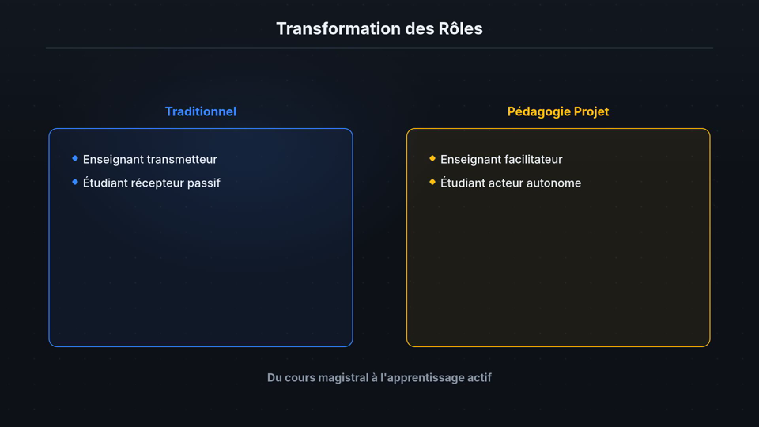
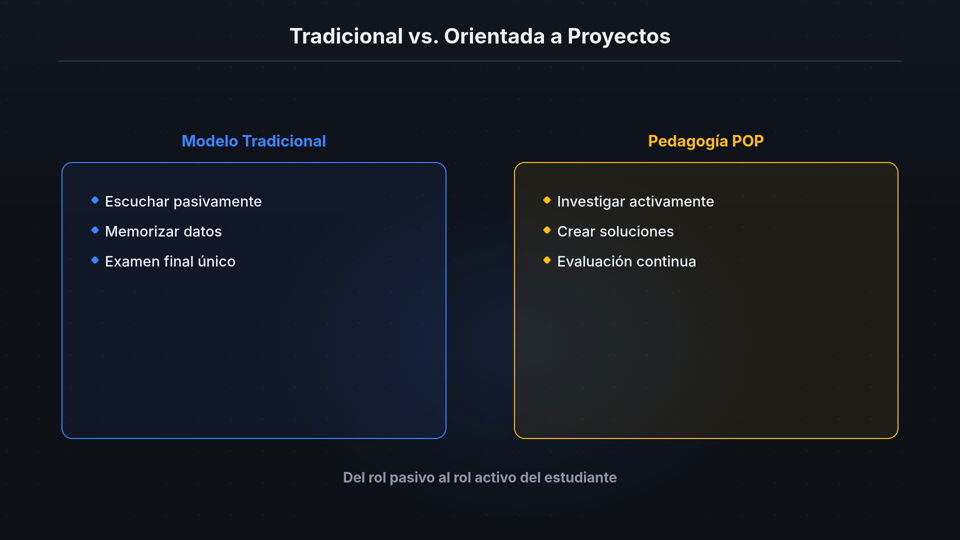

# PromptLoom

**Turn prompts into educational videos.**

[](https://github.com/Tutanka01/manim-video-voice-generator/actions/workflows/ci.yml)
[](https://github.com/Tutanka01/manim-video-voice-generator/actions/workflows/ci.yml)
[](https://www.python.org/)

PromptLoom transforme un prompt en vidéo éducative complète : recherche,
scénario, narration multilingue, scènes animées, voix, rendu, assemblage et
contrôles qualité. Le tout est exposé par une API asynchrone et reproductible.

[Commencer ici](docs/START_HERE.md) · [Créer sa première vidéo](docs/FIRST_VIDEO.md) ·
[Référence API](apps/video-api/docs/api-reference.md) ·
[Architecture](apps/video-api/docs/architecture.md)

## Exemples générés avec PromptLoom

Clique sur une image pour ouvrir la vidéo MP4 correspondante.

| Français | Español |
| --- | --- |
| [](videos/examples/fran%C3%A7ais-exemple.mp4) | [](videos/examples/espagnol-exemple.mp4) |
| **Pédagogie orientée projet** — 4 min 27, 1080p30, narration française. [Regarder la vidéo](videos/examples/fran%C3%A7ais-exemple.mp4) | **Pedagogía orientada a proyectos** — 5 min 30, 1080p30, narración española. [Ver el vídeo](videos/examples/espagnol-exemple.mp4) |

## Ce que fait la plateforme

```text
prompt utilisateur
  -> recherche et sources optionnelles
  -> blueprint pédagogique validé
  -> narration + scènes + beats visuels
  -> voix locale, distante ou compatible OpenAI
  -> rendu Manim ou Remotion
  -> assemblage ffmpeg
  -> ffprobe + freezedetect + snapshots + revue optionnelle
  -> MP4 téléchargeable
```

PromptLoom sait notamment produire une vidéo dans une langue différente de
celle du prompt, générer un même contenu dans plusieurs langues et réparer un
job lorsque la génération ou le rendu échoue.

## Où commencer ?

| Ton objectif | Parcours recommandé |
| --- | --- |
| Découvrir le résultat | Regarde les [deux exemples](#exemples-générés-avec-promptloom), puis lis [Comment ça marche](docs/START_HERE.md#le-modèle-mental-en-90-secondes). |
| Générer une première vidéo | Suis le tutoriel [Première vidéo](docs/FIRST_VIDEO.md). |
| Intégrer l'API | Lis la [référence HTTP](apps/video-api/docs/api-reference.md) et le [contrat LLM](apps/video-api/docs/llm-contract.md). |
| Contribuer au code | Commence par le [guide développeur](apps/video-api/docs/developer-guide.md). |
| Déployer ou diagnostiquer | Utilise le [guide d'exploitation](apps/video-api/docs/operations.md). |
| Installer le TTS sur un GPU séparé | Consulte [`apps/tts-server`](apps/tts-server/README.md). |

## Démarrage en cinq étapes

### 1. Prérequis

- Docker avec Docker Compose 2.20 ou plus récent;
- un endpoint LLM compatible OpenAI pour une vraie génération;
- suffisamment d'espace disque pour l'image worker, qui inclut les moteurs de
  rendu et les dépendances audio;
- `curl` et Python 3 pour les commandes de ce guide.

Le premier build est volontairement lourd. Les builds suivants réutilisent les
couches Docker tant que les manifestes de dépendances ne changent pas.

### 2. Configurer

```bash
cp apps/video-api/.env.example .env
```

Renseigne au minimum :

```text
OPENAI_BASE_URL=http://host.docker.internal:8000/v1
OPENAI_API_KEY=...
OPENAI_MODEL=...
```

Sans LLM, `VIDEO_API_FAKE_LLM=1` permet de vérifier le pipeline avec un
blueprint déterministe. Ce mode évite l'appel LLM, mais la voix et le rendu
restent de vraies étapes.

### 3. Vérifier et lancer

```bash
make doctor
make start
make health
```

Équivalent sans `make` :

```bash
docker compose config --quiet
docker compose up --build -d
curl http://localhost:8080/healthz
```

### 4. Créer un premier job

Le profil `draft` et une cible de 60 secondes réduisent le temps de cette
première boucle :

```bash
RESPONSE=$(curl -sS -X POST http://localhost:8080/v1/videos \
  -H 'Content-Type: application/json' \
  -d '{
    "prompt": "Explain visually why derivatives measure instantaneous change",
    "theme": "math",
    "language": "en",
    "target_duration_seconds": 60,
    "quality_profile": "draft"
  }')

echo "$RESPONSE"
JOB_ID=$(printf '%s' "$RESPONSE" | python3 -c 'import json,sys; print(json.load(sys.stdin)["job_id"])')
echo "Job: $JOB_ID"
```

Suivre le job :

```bash
curl "http://localhost:8080/v1/videos/$JOB_ID"
docker compose logs -f worker
```

### 5. Télécharger le résultat

Quand `status` vaut `completed` :

```bash
curl -L "http://localhost:8080/v1/videos/$JOB_ID/download" -o promptloom-demo.mp4
curl "http://localhost:8080/v1/videos/$JOB_ID/report"
```

Le tutoriel [Première vidéo](docs/FIRST_VIDEO.md) explique chaque étape, les
choix de moteur et les erreurs fréquentes.

## Choisir son mode de production

| Choix | Utiliser quand | Point d'attention |
| --- | --- | --- |
| `quality_profile=draft` | Boucle rapide EN/FR | Force Kokoro et un rendu réduit. |
| `quality_profile=standard` | Livraison normale | Utilise la voix et le rendu configurés sur le serveur. |
| `quality_profile=high` | Livraison avec contrôle renforcé | Nécessite un modèle vision pour la revue visuelle complète. |
| `production_mode=technical` | Schémas, code, mathématiques, systèmes | Mode historique et prévisible. |
| `production_mode=editorial` | Explication sourcée et plus narrative | Demande un fournisseur de recherche si la recherche est requise. |
| `production_mode=cinematic` | Motion design Remotion à 60 fps | Plus coûteux en rendu et incompatible avec Manim. |
| `render_engine=manim` | Diagrammes techniques, graphes, équations | Pipeline Python historique. |
| `render_engine=remotion` | Compositions React et motion design | Utilise Node et Chrome headless dans le worker. |

La plateforme est actuellement optimisée pour les sujets STEM. Son architecture
est extensible, mais un nouveau domaine demande d'adapter les contrats
éditoriaux et les composants visuels, pas uniquement le prompt.

## Architecture

```text
client
  -> FastAPI api
       -> Postgres (jobs et états)
       -> Redis (file Celery)
            -> worker
                 -> LLM / recherche / médias
                 -> TTS
                 -> Manim ou Remotion
                 -> ffmpeg et contrôles qualité
                 -> /data/jobs/<job_id>/
```

- `api` répond rapidement et ne rend jamais la vidéo lui-même.
- `worker` exécute les étapes longues et persiste chaque transition.
- `/data/jobs` est un volume Docker partagé; l'API n'écrit pas dans les exemples
  suivis par Git.
- `tts-server` est optionnel et permet de garder MOSS-TTS chargé sur une machine
  GPU dédiée.

## Organisation du dépôt

```text
.
├── compose.yaml                 # point d'entrée de la plateforme
├── Makefile                     # commandes d'onboarding et de développement
├── apps/
│   ├── video-api/               # produit principal
│   └── tts-server/              # service GPU optionnel
├── docs/                        # parcours, architecture et références
└── videos/
    ├── examples/                # MP4 de démonstration
    └── linux-fondamentaux/      # origine historique du projet
```

Voir [Organisation du dépôt](docs/REPOSITORY_STRUCTURE.md) pour les frontières
entre composants.

## Commandes utiles

```bash
make help       # liste les commandes
make doctor     # vérifie Docker et la configuration
make start      # build et démarrage en arrière-plan
make health     # vérifie l'API, Postgres et Redis
make status     # affiche les services
make logs       # suit api + worker
make down       # arrête sans supprimer les données
make test       # tests video-api; peut construire l'image si elle manque
make test-tts   # tests du service TTS optionnel
```

Ne lance pas `docker compose down -v` sauf si tu veux supprimer les jobs et la
base locale.

## Documentation

- [Commencer ici](docs/START_HERE.md)
- [Créer sa première vidéo](docs/FIRST_VIDEO.md)
- [Index de documentation](docs/README.md)
- [Référence API](apps/video-api/docs/api-reference.md)
- [Architecture détaillée](apps/video-api/docs/architecture.md)
- [Guide développeur](apps/video-api/docs/developer-guide.md)
- [Exploitation et configuration](apps/video-api/docs/operations.md)
- [Contrat LLM](apps/video-api/docs/llm-contract.md)
- [Moteur Remotion](apps/video-api/docs/remotion-engine.md)
- [Production avancée](apps/video-api/docs/advanced-production.md)

## Sécurité avant exposition publique

Par défaut, l'API locale est ouverte. Avant de l'exposer sur un réseau, configure
`VIDEO_API_KEYS`, protège les secrets LLM/TTS, limite l'accès au volume des jobs
et configure `VIDEO_API_WEBHOOK_SECRET` si tu utilises les callbacks.

## Origine du projet

PromptLoom est né de deux vidéos Manim sur le kernel Linux et les appels système.
Ces productions ont imposé les principes qui structurent encore la plateforme :
la narration et l'image doivent raconter la même chose, les durées viennent de
l'audio réel et chaque livraison doit être vérifiée. Elles restent disponibles
dans `videos/linux-fondamentaux/` comme références historiques.

## Validation des contributions

Effectue les modifications d'abord, puis lance une seule passe de validation :

```bash
python3 -m py_compile $(find apps/video-api/src apps/video-api/tests -name '*.py' -print)
docker compose config --quiet
docker compose run --rm test
git diff --check
git status --short
```
